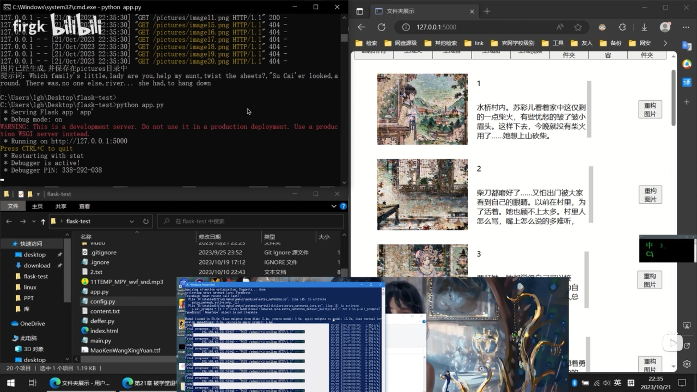

# textsToVideo

[演示视频](https://www.bilibili.com/video/BV1Jj411e7XK/)

## 小说推文生成神器

[使用视频](https://www.bilibili.com/video/BV1Au4y1W7qz/)

使用stable diffusion api生成图片,结合python的一系列对媒体操作的库,生成十分简单的小说推文.

**喜欢的话请给我一个star**

## 项目介绍

- 这个项目涉及了多种技术和工具的使用，具体包括：
- 自然语言处理（NLP）：利用正则表达式、分词等技术对文本进行处理和分割，以及使用 NLTK 库进行词性标注和停用词过滤等操作。
- 文本分割：使用正则表达式和分割符号对长文本进行分割成短段落，便于后续处理。
- 语音合成：利用 gTTS（Google Text-to-Speech）和 edge-tts 等工具将文本内容转换成语音文件。在 edge-tts 中，还使用了 subprocess 调用外部命令进行语音合成。
- 图像处理：使用 PIL（Python Imaging Library）和 moviepy 等库将文本内容转换成图片，用于后续视频生成。
- 视频生成：利用 moviepy 库将语音文件和图片合成为视频，生成以文本内容为基础的视频内容。
- 内容翻译：使用百度翻译 API 对文本内容进行翻译，实现中文文本到英文文本的翻译功能。
- 关键词提取：使用 TF-IDF 算法对文本中的关键词进行提取，帮助理解文本的主题和内容。
- 文件操作：利用 os 和 shutil 等库对文件进行操作，包括创建文件夹、删除文件等功能。
- 网络请求：使用 requests 库进行 HTTP 请求，与外部服务进行数据交互，如使用百度翻译 API 进行文本翻译。
- 这些技术和工具的综合应用，实现了将文本转换成多种多媒体内容的功能，丰富了文本内容的表现形式，提升了用户体验。

## 使用教程( windows10 )

1. 安装 python Python 3.7.9
2. 安装依赖`pip install -r requirements.txt` 
3. 安装[Imagemagick] 并且添加到环境变量
> 参考:
> (https://blog.csdn.net/popboy29/article/details/135587838) (https://zhuanlan.zhihu.com/p/687794898)
4. 在这个网站 https://github.com/BtbN/FFmpeg-Builds/releases?page=3
下载 Auto-Build 2023-09-30 的 ffmpeg-N-112236-g2cb2465cc7-win64-gpl.zip
解压之后 将`bin`目录下的三个 `exe` 文件拷贝到本项目的根目录
5. 配置`stablediffusion api` : 在`deffer.py`中的指定`stable_diff_api` , 演示中使用的是 2023年10月份的 搭建的`stable_diff`
6. 点击`start.bat`运行

## 注意
为了方便大家调试,代码中使用的是我本人的百度翻译api,后期可能失效

# English Version

## Novel tweet generation artifact

[Demo Video](https://www.bilibili.com/video/BV1Au4y1W7qz/)
Generate images using the stable diffusion API, combined with a series of media operation libraries in Python, to generate very simple novel tweets

**If you like, please give me a star**

## Project Introduction

-This project involves the use of various technologies and tools, including:
-Natural Language Processing (NLP): Using techniques such as regular expressions and word segmentation to process and segment text, as well as using the NLTK library for part of speech tagging and stop word filtering.
-Text segmentation: Using regular expressions and segmentation symbols to segment long text into short paragraphs for easier subsequent processing.
-Speech synthesis: Using tools such as gTTS (Google Text to Speech) and edge ts to convert text content into speech files. In edge tts, subprocess is also used to call external commands for speech synthesis.
-Image processing: Use libraries such as PIL (Python Imaging Library) and Moviepy to convert text content into images for subsequent video generation.
-Video generation: Using the Moviepy library to synthesize voice files and images into videos, generating video content based on text content.
-Content translation: Use Baidu Translate API to translate text content, achieving the translation function from Chinese text to English text.
-Keyword extraction: Use TF-IDF algorithm to extract keywords from text, helping to understand the theme and content of the text.
-File operation: Use libraries such as OS and SHUTIL to operate files, including functions such as creating folders and deleting files.
-Network request: Use the requests library for HTTP requests, interact with external services for data, such as using Baidu Translate API for text translation.
-The comprehensive application of these technologies and tools has achieved the function of converting text into various multimedia content, enriched the expression forms of text content, and improved the user experience.

## User Guide

1. Install Python 3.7.9
2. Install Dependencies `pip install -r requirements.txt`
3. Install [Imagemagick] and add it to the environment variable
> 参考:
> ( https://blog.csdn.net/popboy29/article/details/135587838 ) ( https://zhuanlan.zhihu.com/p/687794898 )
4. Configure the `stablediffusion api` : specify the `Stable_diff_api` in `deffer.py`
5. Click on `start.bat` to run

## Attention

For the convenience of debugging, I am using my own Baidu Translate API in the code, which may become invalid in the future

